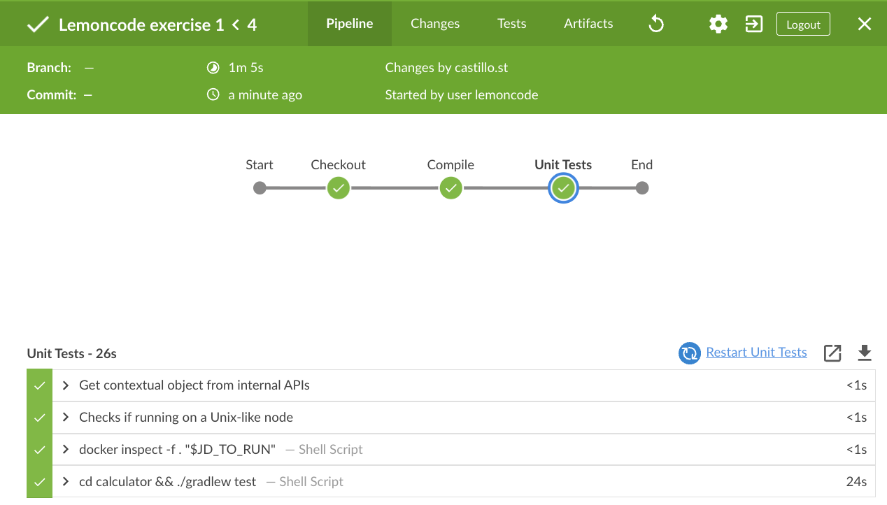
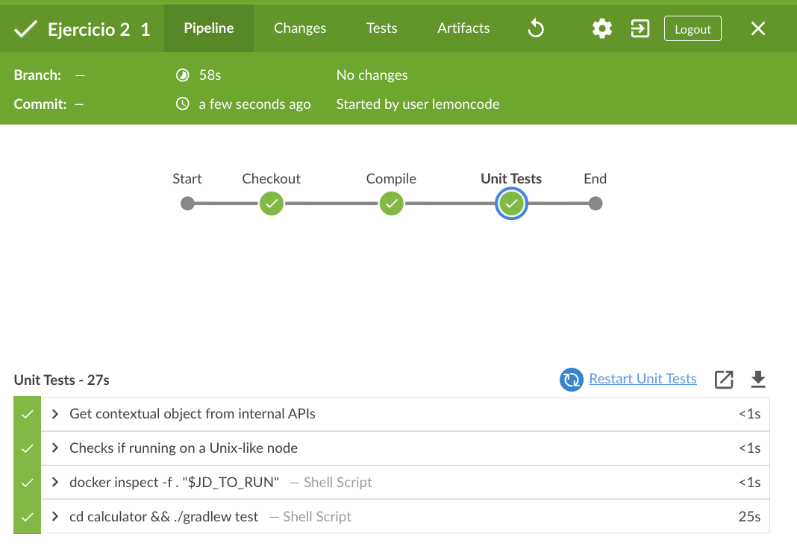

# jenkinks-calculator

## Ejercicios Jenkins

### 1. CI/CD de una Java + Gradle - OBLIGATORIO

Crea un `Jenkinsfile` que contenga una pipeline declarativa con los siguientes stages:

- **Checkout**. Descarga de código desde un repositorio remoto, preferentemente utiliza GitHub
- **Compile**. Compilar el código fuente utilizando `gradlew compileJava`
- **Unit Tests**. Ejecutar los test unitarios utilizando `gradlew test`

Para ejecutar Jenkins en local y tener las dependencias necesarias disponibles podemos contruir una imagen a partir de [este Dockerfile](./jenkins-resources/gradle.Dockerfile)

#### Resultado

Tuve que hacer algunas modificaciones para evitar la emulación de amd6 en mi mac, pero al final lo conseguí:



Pipeline:
```gradle
pipeline {
    agent any
    stages {
        stage('Checkout') {
            steps {
                checkout scm
            }
        }
        stage('Compile') {
            agent {
                docker {
                    image 'eclipse-temurin:11-jdk'
                    reuseNode true
                }
            }
            steps {
                sh 'cd calculator && ./gradlew compileJava'
            }
        }
        stage('Unit Tests') {
            agent {
                docker {
                    image 'eclipse-temurin:11-jdk'
                    reuseNode true
                }
            }
            steps {
                sh 'cd calculator && ./gradlew test'
            }
        }
    }
}
```

### 2. Modificar la pipeline para que utilice la imagen Docker de Gradle como build runner - OBLIGATORIO

- Utilizar Docker in Docker a la hora de levantar Jenkins para realizar este ejercicio
- Como plugins deben estar instalados `Docker` y `Docker Pipeline`
- Usar la imagen de Docker `gradle:6.6.1-jre14-openj9`

#### Resultado



Pipeline:
```gradle
pipeline {
    agent any
    stages {
        stage('Checkout') {
            steps {
                checkout scm
            }
        }
        stage('Compile') {
            agent {
                docker {
                    image 'gradle:6.6.1-jre14-openj9'
                    reuseNode true
                }
            }
            steps {
                sh 'cd calculator && ./gradlew compileJava'
            }
        }
        stage('Unit Tests') {
            agent {
                docker {
                    image 'gradle:6.6.1-jre14-openj9'
                    reuseNode true
                }
            }
            steps {
                sh 'cd calculator && ./gradlew test'
            }
        }
    }
}
```
